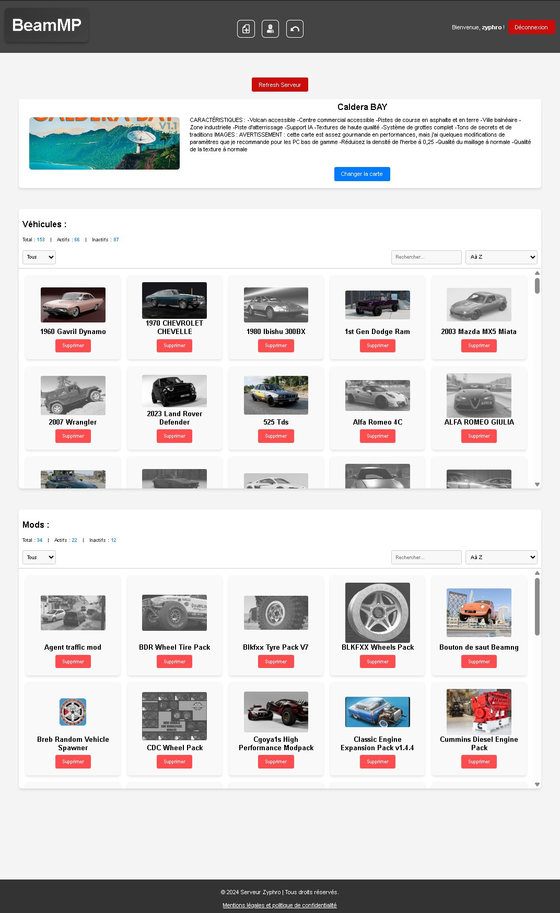

# 🚗 BeamMP-Web – Web management interface for BeamMP servers

> 🔄 This project is a **fork of [IxeYgrek/BeamMP-Web-Interface](https://github.com/IxeYgrek/BeamMP-Web-Interface)**,  
> initially built by IxeYgrek. Huge thanks to them for their clean and inspiring base!  
> 🤖 This updated version was created with the ongoing help of **ChatGPT**, as part of a full customization effort.

---

## 🌐 What is BeamMP-Web?

**BeamMP-Web** is a lightweight, multilingual and secure **web interface** designed to manage your **BeamMP server** from any browser – local or remote.  
The goal is to simplify server administration while maintaining full control over mods, maps, configurations and server state.

Whether you're hosting a public server or a local private game, BeamMP-Web helps you **manage everything from a single panel**.

---

## ✨ Current Features

- 🔐 **Secure login system**
- 🌍 Works over **local HTTP** or **HTTPS with your own domain**
  > ⚠️ In local HTTP mode, webhook images may not display correctly
- 📦 Add / remove **mods**, **maps**, and **vehicles**
- ✅ Enable / disable mods and vehicles individually (just click on the image to toggle – greyed out means disabled)
- 🗺️ **Live map switching** (no restart required)
- 📄 View **BeamMP server logs** directly from the interface
- ⚙️ Edit the `serverConfig.toml` configuration file
- 📣 **Connection/disconnection webhooks** with custom rank system
- 📊 **Live server status webhook** (refresh feedback)
- 🔁 **Webhook on mod upload** from the web interface

---

## 👤 Author

Project maintained by **[Zyphro3D](https://github.com/Zyphro3D)**  
Open to suggestions, improvements, and community feedback.

---

## 📝 License

Licensed under the **MIT License** – Free to use, just keep the credits 🙌

---

🇬🇧 [English tutorial](./docs/INSTALL_EN.md)

---

# 🇫🇷 BeamMP-Web – Interface web de gestion pour serveurs BeamMP

> 🔄 Ce projet est un **fork de [IxeYgrek/BeamMP-Web-Interface](https://github.com/IxeYgrek/BeamMP-Web-Interface)**  
> créé initialement par IxeYgrek – un grand merci à lui pour sa base propre et inspirante 🙏  
> 🤖 Cette refonte a été réalisée avec l’aide continue de **ChatGPT**, pour répondre à mes besoins spécifiques.

---

## 🌐 Qu’est-ce que BeamMP-Web ?

**BeamMP-Web** est une interface web multilingue, sécurisée et légère permettant de **gérer votre serveur BeamMP** depuis n’importe quel navigateur, en local ou à distance.  
Elle offre un panel centralisé pour **gérer vos mods, maps, fichiers de config, logs et webhooks**, sans toucher à la console.

Que vous hébergiez un serveur privé ou public, **BeamMP-Web vous simplifie l’administration**.

---

## ✨ Fonctionnalités actuelles

- 🔐 **Connexion sécurisée**
- 🌍 Utilisable en **HTTP local** ou en **HTTPS avec votre propre domaine**
  > ⚠️ En HTTP local, les images des webhooks ne s’affichent pas
- 📦 **Ajout / suppression** de **mods**, **maps**, et **véhicules**
- ✅ **Activation / désactivation** des mods et véhicules individuellement (il suffit de cliquer sur l’image pour activer ou désactiver – en gris = désactivé)
- 🗺️ **Changement de map à la volée** (sans redémarrage)
- 📄 **Affichage des logs du serveur BeamMP**
- ⚙️ **Édition du fichier `serverConfig.toml`**
- 📣 **Webhook de connexion / déconnexion** avec système de rangs personnalisés
- 📊 **Webhook de rafraîchissement** avec état serveur en temps réel
- 🔁 **Webhook lors de l’ajout de mod** depuis l’interface web

---

## 👤 Auteur

Projet maintenu par **[Zyphro3D](https://github.com/Zyphro3D)**  
Suggestions, retours, et contributions sont les bienvenus.

---

## 📝 Licence

Projet sous **licence MIT** – Libre d’utilisation, tant que les crédits sont conservés 🙌

---

🇫🇷 [Tutoriel en français](./docs/INSTALL_FR.md) 
